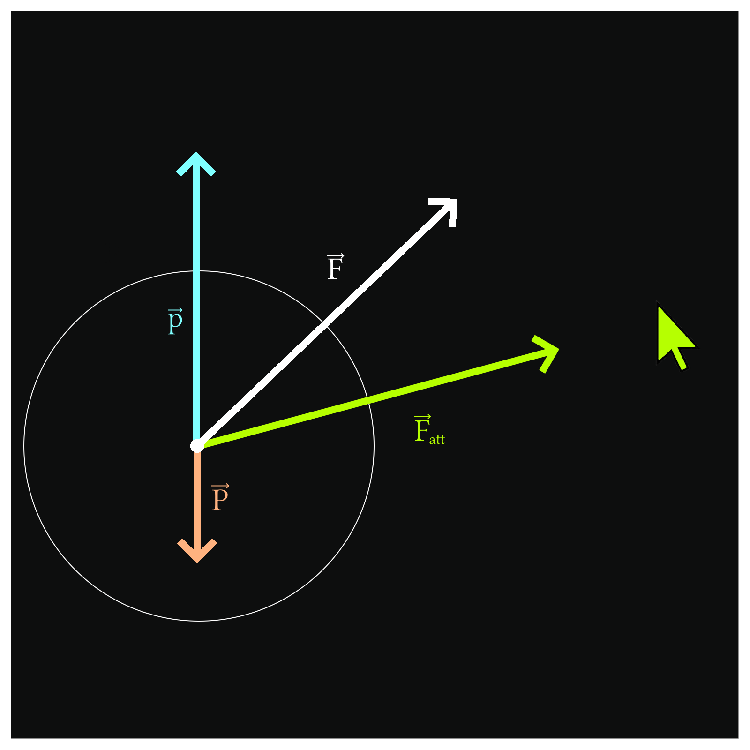

This is a website with a simple physics simulation of a ball in a box attracted by your mouse.
You can visit it in the [github page](https://zevier02.github.io/PhysicsSimulation/) or in my website [zevier.fr](https://zevier.fr).

